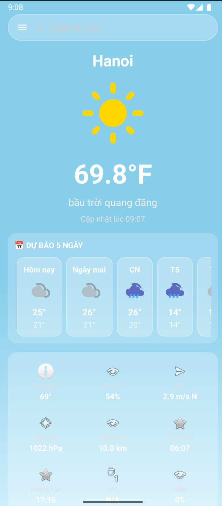

# ☀️ Android Weather App

<div align="center">



### A Native Android Application for Real-time Weather Forecasting

<p>
  
  
  
  
</p>

</div>

---

## 📱 Introduction

**Android Weather App** is a native mobile application that allows users to check real-time weather conditions and forecasts for any city worldwide. The app is built with **Java** and follows clean architecture principles, utilizing **Retrofit** for efficient networking and data parsing.

## ✨ Key Features

- **🔍 City Search:** Search for any city to get instant weather updates.
- **🌡️ Real-time Data:** Display current temperature, humidity, wind speed, and weather conditions.
- **📅 5-Day Forecast:** View upcoming weather trends (3-hour intervals).
- **🎨 User-Friendly UI:** Clean XML-based layout with intuitive navigation.
- **🔄 Smart Conversions:** Automatic handling of units (Kelvin to Celsius) and date formatting.

## 🛠️ Tech Stack

This project is built using native Android technologies and modern libraries to ensure performance and maintainability.

<div align="center">

<h3>Core & Architecture</h3>
<p>
  
  
  
  
</p>

<h3>Networking & Data</h3>
<p>
  
  
  
</p>

<h3>Tools & Build System</h3>
<p>
  
  
  
</p>

</div>

## 🚀 How to Run

1. **Clone the repository**
   ```bash
   git clone [https://github.com/DeiCroissant/ProjectAndroidWeatherApp.git](https://github.com/DeiCroissant/ProjectAndroidWeatherApp.git)